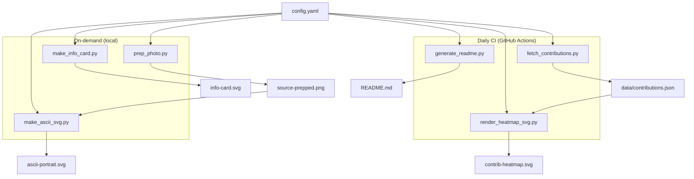

# Rishit Jariwala

[](#)
[](https://github.com/RishitJariwala/RishitJariwala/actions/workflows/update-profile-art.yml)

> Animated GitHub Profile README — powered by Python + SVG + GitHub Actions.

---

## Overview

This profile is built and maintained entirely by code. No JavaScript. No third-party services. No GitHub tokens. Everything runs on:

- **Python** scripts that generate SVG assets
- **SVG animations** (CSS keyframes + SMIL) for motion
- **GitHub Actions** for daily automatic updates
- **Public GitHub API** for contribution data (zero auth required)

**Architecture:**


---

## Quick Start

### 1. Prerequisites

- Python 3.10+
- Git
- A GitHub account with a special `<username>` repository

### 2. Clone

```bash
git clone https://github.com/RishitJariwala/RishitJariwala.git
cd RishitJariwala
```

### 3. Install dependencies

**For CI (daily automation):**
```bash
pip install -r requirements.txt
```

**For local portrait generation (heavier deps):**
```bash
pip install -r requirements.txt
pip install pillow numpy opencv-python rembg onnxruntime
```

### 4. Configure

Edit `config.yaml` with your information.

### 5. Add a profile photo

Place a photo at `assets/profile-photo.jpg`, then:
```bash
python scripts/prep_photo.py
python scripts/make_ascii_svg.py
```

### 6. Generate everything

```bash
python scripts/rebuild.py --force
```

### 7. Commit and push

```bash
git add .
git commit -m "Initial profile setup"
git push
```

---

## File Structure

```
RishitJariwala/
├── README.md                    # This file — auto-generated
├── config.yaml                  # All configuration
├── requirements.txt             # Python dependencies
├── .gitignore
├── LICENSE
│
├── ascii-portrait.svg           # Generated animated ASCII portrait
├── info-card.svg                # Generated neofetch-style info card
├── contrib-heatmap.svg          # Generated animated contribution heatmap
│
├── assets/
│   └── profile-photo.jpg        # Source photo (not committed)
│
├── data/
│   └── contributions.json       # Cached contribution data
│
├── scripts/
│   ├── __init__.py
│   ├── prep_photo.py            # Photo processing pipeline
│   ├── make_ascii_svg.py        # ASCII → animated SVG
│   ├── make_info_card.py        # Neofetch card generator
│   ├── fetch_contributions.py   # GitHub data scraper
│   ├── render_heatmap_svg.py    # Heatmap renderer
│   ├── generate_readme.py       # README assembly
│   ├── rebuild.py               # Smart rebuild orchestrator
│   ├── utils.py                 # Shared utilities
│   └── types.py                 # Type definitions
│
└── .github/
    └── workflows/
        └── update-profile-art.yml  # Daily automation
```

---

## Customisation Guide

### Changing colours

Edit `config.yaml` — every colour is configurable:
- `ascii.char_color` — text colour
- `ascii.bg_color` — background colour
- `info_card.*_color` — per-element colours
- `heatmap.palette` — contribution level colours

### Changing the animated text

Edit fields in `config.yaml` under `info_card.fields`. Add or remove sections by modifying the field keys.

### Changing animation speed

- `ascii.typing_speed_ms` — ms per character
- `info_card.animation.row_delay_ms` — stagger delay
- `heatmap.diagonal_delay_ms` — cell reveal speed

---

## How It Works

### Daily Automation

A GitHub Actions workflow runs daily at 06:17 UTC:

```
1. Check out repository
2. Install Python dependencies
3. Fetch contributions from GitHub (no token needed)
4. Render contribution heatmap SVG
5. Update README
6. Commit changes if any
```

### Animation Technique

All animations use pure SVG + CSS keyframes:

- **ASCII portrait:** Each row has a `<clipPath>` that expands left-to-right via `<animate>`. A blinking `<rect>` cursor follows the typing edge.
- **Info card:** Each row uses `@keyframes fadeSlideIn` with staggered `animation-delay`.
- **Heatmap:** Each cell uses `@keyframes cellReveal` with diagonal stagger.

### Zero Authentication

The contribution fetcher downloads `https://github.com/users/<username>/contributions` — the same public HTML fragment GitHub uses for profile pages. No PAT, OAuth, or GraphQL required.

---

## Troubleshooting

### Heatmap shows no data

Run the fetcher manually:
```bash
python scripts/fetch_contributions.py --verbose
```

### SVG animations don't play

GitHub requires SVGs to be embedded via `` tags. Check that the README uses correct `` syntax.

### `rembg` import error

Install the full dependencies:
```bash
pip install pillow numpy opencv-python rembg onnxruntime
```

### Workflow fails to commit

Ensure the repository has `contents: write` permission in Settings → Actions → General → Workflow permissions.

---

## Configuration Reference

| Section | Key | Default | Description |
|---------|-----|---------|-------------|
| `username` | — | `RishitJariwala` | GitHub username |
| `ascii` | `width` | `80` | Character grid width |
| `ascii` | `ramp` | ` .\`:-=+*cs#%@` | Density ramp |
| `ascii` | `typing_speed_ms` | `30` | Typing speed |
| `info_card` | `font_size` | `13` | Font size |
| `info_card` | `animation.row_delay_ms` | `100` | Row stagger |
| `heatmap` | `cell_size` | `13` | Cell size in px |
| `heatmap` | `palette` | `["#161b22", ...]` | Colour ramp |
| `heatmap` | `diagonal_delay_ms` | `5` | Cell reveal speed |
| `readme` | `heatmap_width` | `860` | Heatmap width |
| `readme` | `portrait_width` | `370` | Portrait width |
| `readme` | `card_width` | `490` | Card width |
| `automation` | `schedule` | `17 6 * * *` | Cron schedule |

---

## FAQ

**Q: Does this require a GitHub token?**
A: No. The contribution scraper uses a public HTML endpoint.

**Q: Can I customise the fonts?**
A: Yes. Set `font_family` in each section of `config.yaml`.

**Q: Why SVG instead of GIF?**
A: SVGs are sharper, smaller, scalable, and support CSS/SMIL animations.

**Q: How often does it update?**
A: Daily at 06:17 UTC. The contribution graph is the only dynamic element.

**Q: What if the contribution fetch fails?**
A: The workflow uses cached data from the last successful run.

---

## License

MIT

---

<p align="center">
  <sub>Built with Python, SVG, and GitHub Actions</sub>
</p>
