<div align="center">

```ansi
RishitJariwala@github
--------------------------
```


  <h3><code>RishitJariwala@github ~ $ <font color="#56d364">./contributions.sh</font></code></h3>

  

  <br>
  <h3><code>RishitJariwala@github ~ $ <font color="#79c0ff">whoami</font></code></h3>

  <br>
  <table>
    <tr>
      <td valign="top"></td>
      <td valign="top"></td>
    </tr>
  </table>

  <br>
  <h3><code>RishitJariwala@github ~ $ <font color="#ff6b6b">echo $STACK</font></code></h3>

  <br>
  <table>

    <tr>
      <td><code>Languages</code></td>
      <td><code>Python · Java · .NET · SQL · C/C++ · PHP · Kotlin · Dart</code></td>
    </tr>

    <tr>
      <td><code>Frameworks</code></td>
      <td><code>FastAPI · Flutter · ERP Modules · Vulnerability Assessment</code></td>
    </tr>

    <tr>
      <td><code>Tools</code></td>
      <td><code>Git · VS Code · Linux · Penetration Testing · UAT</code></td>
    </tr>

    <tr>
      <td><code>OS</code></td>
      <td><code>macOS · Linux</code></td>
    </tr>

  </table>

<br>
<br>
<details>
  <summary><code>~ $ echo "Visit my website"</code></summary>

  <a href="https://github.com/RishitJariwala">GitHub</a> ·

  <br>
  <sub><i>README auto-generated with Python + SVG animations</i></sub>
</details>

</div>
